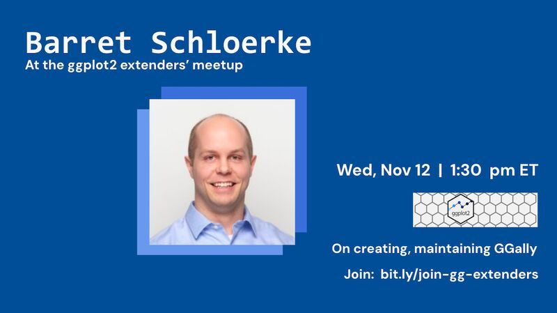

# `{GGally}`: Success and Long-Haul Maintenance Strategies

## Helpful links

* [Slides](https://schloerke.com/presentation-2025-11-12-ggplot2-extenders-GGally/)
* [`GGally`](https://ggobi.github.io/ggally/): Extension to ggplot2
* [`ggplot2`](https://ggplot2.tidyverse.org/): Create elegant data visualisations using the grammar of graphics

------------------------

## Introduction

Dr. Barret Schloerke is a Shiny Software Engineer at Posit who specializes in developing interactive web applications and data visualization tools. He has significantly contributed to many open-source R packages including {shiny}, {shinytest2}, {plumber}, and {reactlog}. In addition to his work in R, Barret also works on Shiny for Python, implementing its testing tools, bookmarking, and interactive data frame experience. Blending his extensive expertise in statistical computing, large data visualization, and automated testing systems, Barret has been able to speed up Shiny app development, allowing developers to focus on building robust and reproducible applications.  He self-describes as a "code[c("architect", "manager", "philosopher")]  and data[c("wrangler", "explorer", "visualizer")]".  We are extremely pleased to have him join us today!
